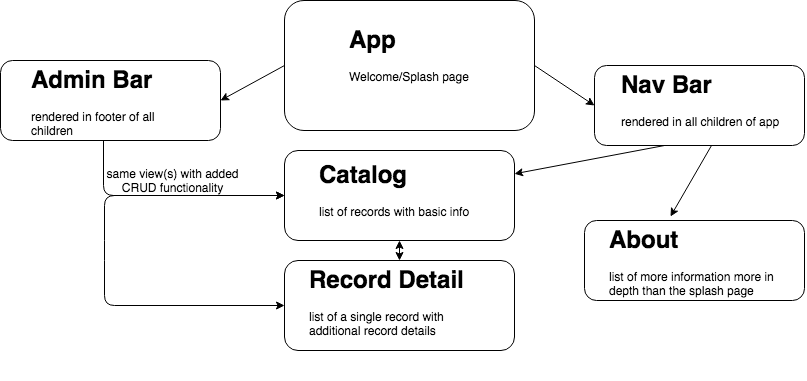

# Record Store Redux

#### Epicodus React week 1 independent project

#### By Matt Smith

## Description

This app is a re-creation of the [Epicodus Record Store](https://github.com/MattSmithereens/album-store) example.  I chose this particular project because my pair and I never got a working MVP of the Tap Room (not to mention I had to go at it solo on day 2) and the other notable project that I did that week was an adventure game that became too unweildy because my pair and I took the wrong approach and created something unecessarily convoluted.  As I understand it, the point of this excercise is to rethink and refactor an Angular project, not to solve problems and/or build a previous project from scratch.  I know that the record store works, I understand the file structure and I will have something functional to reference.

## Objectives

* Development environment is fully-functional, including Babel transpiling, Webpack module bundling, a development server with hot module replacement, and linting.
* Components are used to create modular UI elements.
propTypes define data types and shapes for all component props.
* Application successfully uses client-side routing via the React-Router library to create appearance of multiple pages.
* Styles are successfully added using CSS objects.
* Project was submitted by the Friday deadline.
* Project demonstrates an understanding of this week's concepts. If prompted, you can discuss your code with an instructor using the correct terminology.

## Component structure

## Contribution Requirements

1. Clone the repo
1. Make a new branch
1. Commit and push your changes
1. Create a PR

## Technologies Used

## Links

* GitHub Repo: https://github.com/MattSmithereens/react-angular-port

## License

This software is licensed under the MIT license.

Copyright (c) 2018 **Matt Smith**
